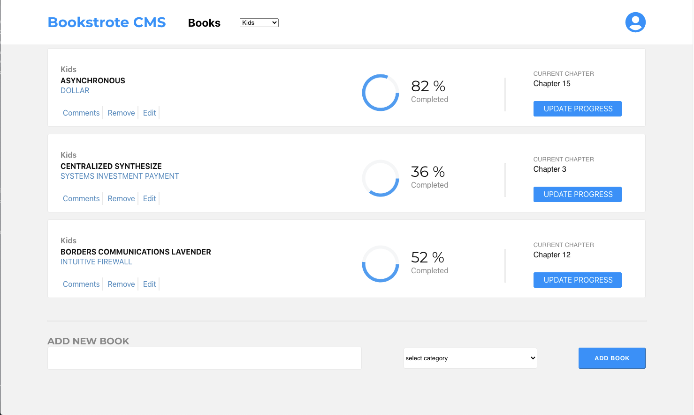

# Bookstore CMS App Frontend with React and Redux

In this project React and Redux are used to build the front-end of the bookstore application that will help to the fictional bookseller company to organize and manage their bookstore. It must be fast, dynamic and responsive to user actions. Therefore I decided to build it with React & Redux. [The specific UI](https://app.zeplin.io/project/5b35a9e13227086040f8eb75/screen/5b695e29bb8c844f118f9378) is implemented besides the functionality of the app. The github workflow, ESLint and Stylelint [linter guidlines by Microverse](linters-config/javascript at master · m…) is followed. 

## Screenshot



## Livedemo

- [Click Here](https://react-bookstore-cms-by-ramin.herokuapp.com)

## Video presentation

- Soon will be here.


## Milestones of the project.

- [x] Miltestone 1 - Basic project structure
  - Import necessary libraries and remove unnecessary files.
- [x] Miltestone 2 - Components and Redux store are implemented. The following tasks are done:
  - Prepare the directory structure
  - Implement the `App` component
  - Implement the `BooksList` component
  - Implement the `Book` component
  - Implement the `BooksForm` component
  - Define the Redux actions and reducers
  - Initialize the Redux store
  - Create fake books with the help of [faker](https://www.npmjs.com/package/faker) library.
  - Introduce `mapStateToProps` to reach the state as a props in container components.
- [x] Miltestone 3 - Interactive form is created and configured. The following tasks are done:
  - Make the `BooksForm` component stateful.
  - Connect the `CREATE_BOOK` action to the component.
  - Connect the `REMOVE_BOOK` action to the component.
- [x] Miltestone 4 - Category filter is implemented. The following tasks are done:
  - Add a new presentational component `CategoryFilter` which is a simple select box.
  - Enhance the Redux store to keep information about the current books filter.
  - Create a new Redux action `CHANGE_FILTER` and a `filter.js` reducer which modifier filter in Redux store.
  - Implement the `CategoryFilter` component which renders a select box with filter categories.
  - Render the `CategoryFilter` component in the `BooksList` component.
  - Implement the `handleFilterChange` method which modifies the filter state in the Redux store and it is passed down as a prop to CategoryFilter.
  - Implemented a conditional method which decides which books should be shown in the table depending on the filter value from Redux store.
- [x] Miltestone 5 - [The specific UI](https://app.zeplin.io/project/5b35a9e13227086040f8eb75/screen/5b695e29bb8c844f118f9378) design is implemented and the following tasks are done:
  - Added style classes for the `BooksList` component.
  - Added style classes for the `BooksForm` component.
  - [Recharts](https://github.com/recharts/recharts) library is used to visualize the percentage with piechart.
  - The design is implemented with Pure CSS with Flexbox, none of the extra ui library like Bootstrap is used.

## Built With

- [Node.js]
- [npm](https://www.npmjs.com/)
- [ES6](http://es6-features.org/) 
- [React](https://reactjs.org/)
- [React-DOM](https://reactjs.org/docs/react-dom.html)
- [create-react-app](https://github.com/facebook/create-react-app)
- [React-Redux](https://github.com/reduxjs/react-redux)
- [Redux](https://github.com/reduxjs/redux)
- [PropTypes](https://www.npmjs.com/package/prop-types)
- CSS
- Heroku
- ESLint
- StyleLint
- [Recharts](https://github.com/recharts/recharts)


### Setup

Clone the repo by tuping

```
git clone https://github.com/RaminMammadzada/react-bookstore-cms.git
```

Install packages with

```
  npm install
```

Start server with:

```
  npm start
```
Runs the app in the development mode.\
Open [http://localhost:3000](http://localhost:3000) to view it in the browser.


## Author

👤 **Ramin Mammadzada**

- Github: [@raminmammadzada](https://github.com/raminmammadzada)
- Twitter: [@raminmammadzada](https://twitter.com/raminmammadzada)
- Linkedin: [Ramin Mammadzada](https://www.linkedin.com/in/raminmammadzada/)

### Contributing

Contributions, issues and feature requests are welcome!

Feel free to check the [issues page](https://github.com/RaminMammadzada/react-bookstore-cms/issues)

### Show your support

Give a star if you like this project!

### Acknowledgments

- [Microverse](https://www.microverse.org/)

### 📝 License

This project is MIT licensed.
